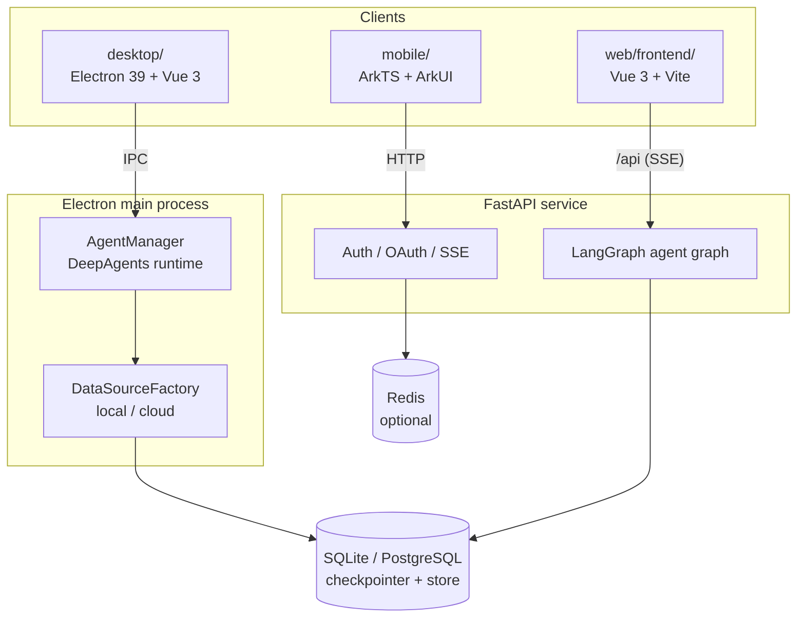

<div align="center">

# WorkMate

**A multi-platform AI agent suite — desktop, mobile and web, powered by DeepAgents.**

[](LICENSE)
[](desktop/)
[](web/frontend/)
[](desktop/)
[](web/backend/)
[](web/backend/)
[](mobile/)
[](https://github.com/langchain-ai/deepagents)

**English** | [简体中文](README.zh-CN.md)

</div>

## Overview

WorkMate is a monorepo that ships one AI agent experience on three platforms. Every client is built on the same
foundation: an agent runtime powered by [DeepAgents](https://github.com/langchain-ai/deepagents) / LangGraph and
DeepSeek models, with streaming responses, long-term memory and per-conversation workspaces.

- **Desktop** — a local-first Electron workbench. Conversations, memory and agent state live in SQLite on your
  machine; an optional cloud mode swaps the data source for PostgreSQL and remote HTTP services without changing
  the interface.
- **Web** — a separated frontend/backend application: a Vue 3 SPA talking to a FastAPI agent service that provides
  authentication, OAuth login, captcha and SSE streaming.
- **Mobile** — a native HarmonyOS app written in pure ArkTS/ArkUI on the Stage model, with zero third-party
  runtime dependencies.

Each client keeps its own README, `AGENTS.md` conventions and toolchain, so you can work on one of them without
building the whole repository.

## Table of Contents

- [Repository Layout](#repository-layout)
- [Highlights](#highlights)
- [Architecture](#architecture)
- [Tech Stack](#tech-stack)
- [Project Structure](#project-structure)
- [Getting Started](#getting-started)
- [Configuration](#configuration)
- [Testing](#testing)
- [Documentation](#documentation)
- [Roadmap](#roadmap)
- [Contributing](#contributing)
- [License](#license)

## Repository Layout

| Path | Platform | Description |
| --- | --- | --- |
| [`desktop/`](desktop/) | Windows / macOS / Linux | **KE-WORK** desktop AI workbench — Electron 39 + Vue 3 + DeepAgents, local-first SQLite with an optional PostgreSQL cloud mode |
| [`web/frontend/`](web/frontend/) | Browser | **Ke Hermes** web UI — Vue 3 + Vite + Element Plus + Pinia, i18n and SSE streaming |
| [`web/backend/`](web/backend/) | Server | **Ke Hermes** agent service — FastAPI + LangGraph + DeepSeek, JWT/RSA auth and OpenSandbox tooling |
| [`mobile/`](mobile/) | HarmonyOS | **KE-WORK** mobile app — ArkTS + ArkUI on the Stage model, SDK 6.1.0 (API 23) |

## Highlights

**Shared agent core**

- [DeepAgents](https://github.com/langchain-ai/deepagents) / LangGraph runtime with DeepSeek models, streaming
  tokens and live "thinking" events.
- Short-term memory through a LangGraph checkpointer and long-term memory through a store — SQLite locally,
  PostgreSQL in cloud mode.
- Agent configuration (model, system prompt, skills, memory files, sub-agents, tools, permissions, response
  format) exposed to the user instead of hard-coded.

**Desktop**

- Local-first design: app data lives in `~/.ke-work`, workspace files in `~/KeWork` by default.
- Two work modes — **local** (SQLite) and **cloud** (PostgreSQL checkpointer/store + remote HTTP API) — selected
  behind a repository abstraction, so only the data source changes.
- Workspaces are bound to conversations and resolved authoritatively in the main process, so forged IDs cannot
  hijack a session.
- Secrets encrypted with Electron `safeStorage`, passwords hashed with bcrypt, and protected IPC routes guarded by
  a main-process session check.
- Packaged with `electron-builder` (NSIS / DMG / AppImage + deb + snap) and updated through `electron-updater`.

**Web**

- Real-time SSE chat with a non-streaming fallback.
- JWT authentication with bcrypt hashing and RSA-2048 encrypted password transmission; phone (SMS) and email
  registration; GitHub, Google and WeChat OAuth; slider captcha.
- Configurable login-failure lockout and SMS rate limits; Redis-backed store with an in-memory fallback.
- Multi-language UI through `vue-i18n`.

**Mobile**

- A fully custom ArkUI design system: animated onboarding, phone login, chat with a hand-rolled Markdown renderer,
  a draggable sidebar drawer and system light/dark theming.
- A strict five-layer one-way dependency (`pages → components → store → services → common`) with a single
  `USE_MOCK` switch that flips the app between mock and real services.

## Architecture

The three clients share the same agent concepts but not the same runtime — the desktop app embeds the agent in its
main process, while the web version runs it behind an HTTP API and the mobile app reaches the same services over
HTTP.


Key design points:

- **Repository pattern** — business services depend on interfaces (`IAuthRepository`, `IConfigRepository`, …) and a
  factory injects the SQLite or cloud implementation, keeping the rest of the app storage-agnostic.
- **The main process is authoritative** — session validity, workspace resolution and agent execution all happen in
  the Electron main process; the renderer only passes IDs, never paths or permissions.
- **Services are interface-only** — pages never talk to a concrete data source, so switching mock/real or
  local/cloud never touches the UI layer.

## Tech Stack

| Layer | Desktop | Web | Mobile |
| --- | --- | --- | --- |
| Shell / runtime | Electron 39, electron-vite, electron-builder, electron-updater | Browser SPA | HarmonyOS Stage model, `@kit.*` APIs |
| Language | TypeScript 5.9 | TypeScript 5.5 (frontend), Python 3.11+ (backend) | ArkTS |
| UI | Vue 3, Pinia, Vue Router, marked | Vue 3, Vite 5, Element Plus, Pinia, ECharts, vue-i18n | ArkUI declarative, V1 + V2 state |
| AI engine | DeepAgents 1.11, LangChain, `@langchain/deepseek` | DeepAgents / LangGraph, DeepSeek LLM | HTTP client to the agent service |
| Storage | better-sqlite3, LangGraph SqliteSaver/SqliteStore | SQLAlchemy async + SQLite/PostgreSQL, Redis (optional) | `@kit.ArkData` Preferences |
| Security | bcryptjs, jsonwebtoken, Electron `safeStorage` | JWT (HS256), bcrypt, RSA-2048 | System pickers, no sensitive permissions |
| Testing | Vitest, Playwright | pytest, ruff, mypy / Vitest | `@ohos/hypium`, `@kit.TestKit` |

## Project Structure

```
workmate/
├── desktop/                    # Electron desktop client (ke-work)
│   ├── src/main/               # Agent runtime, IPC, data sources, security
│   ├── src/preload/            # contextBridge bridge exposed as window.api
│   ├── src/renderer/           # Vue 3 + Pinia UI
│   └── tests/                  # unit / integration / security / e2e
├── mobile/                     # HarmonyOS client
│   ├── AppScope/               # App-level configuration
│   └── entry/src/main/ets/     # pages / components / services / store / common
├── web/
│   ├── frontend/               # Vue 3 + Vite + Element Plus
│   └── backend/                # FastAPI + LangGraph (managed with uv)
├── AGENTS.md                   # Repository conventions
└── LICENSE                     # Apache-2.0
```

## Getting Started

### Prerequisites

| Tool | Version | Needed by |
| --- | --- | --- |
| [Node.js](https://nodejs.org/) | ≥ 20.19 (Vite 7 / Electron 39) | `desktop/`, `web/frontend/` |
| npm | bundled with Node.js | `desktop/`, `web/frontend/` |
| [Python](https://www.python.org/) + [uv](https://docs.astral.sh/uv/) | Python ≥ 3.11 | `web/backend/` |
| [DevEco Studio](https://developer.huawei.com/consumer/cn/deveco-studio/) | 6.x with HarmonyOS SDK API 23 | `mobile/` |

### Desktop app

```bash
cd desktop
npm install
cp .env.sample .env     # add DEEPSEEK_API_KEY (PowerShell: Copy-Item .env.sample .env)
npm run dev
```

Build installers with `npm run build:win`, `npm run build:mac` or `npm run build:linux`. See
[`desktop/README.md`](desktop/README.md) for the full guide, including `better-sqlite3` native binding notes,
available scripts, testing layers and architecture details.

### Web app

The backend and the frontend run as two processes:

```bash
# Terminal 1 — agent service
cd web/backend
cp .env.example .env    # add DEEPSEEK_API_KEY
uv sync
uv run python run.py    # http://127.0.0.1:8001

# Terminal 2 — web UI
cd web/frontend
npm install
npm run dev             # http://localhost:5173, /api is proxied to the backend
```

See [`web/README.md`](web/README.md) and [`web/backend/README.md`](web/backend/README.md) for details.

### Mobile app

1. Open the `mobile/` directory in DevEco Studio 6.x.
2. Let it sync `oh-package.json5` (development dependencies only: `@ohos/hypium`, `@ohos/hamock`).
3. Select the `entry` module and run on a HarmonyOS 5.0+ emulator or device.

Out of the box the app runs in mock mode (`Constants.USE_MOCK = true`), so the whole feature set works without a
backend. See [`mobile/README.md`](mobile/README.md) for the full build and test walkthrough.

## Configuration

Every client reads its own environment file. **Never commit `.env` files, keys or build artifacts.**

**Desktop** — `desktop/.env` (template: `desktop/.env.sample`)

| Variable | Required | Purpose |
| --- | --- | --- |
| `DEEPSEEK_BASE_URL` / `DEEPSEEK_API_KEY` | ✅ | DeepSeek endpoint and key used by the agent |
| `CLOUD_API_BASE_URL` | cloud mode | Base URL of the remote service |
| `CLOUD_POSTGRES_CONN_STRING` | cloud mode | PostgreSQL connection string for the checkpointer and store |
| `LANGSMITH_TRACING` / `LANGSMITH_API_KEY` | optional | LangSmith observability |

**Web backend** — `web/backend/.env` (template: `web/backend/.env.example`)

| Variable | Required | Purpose |
| --- | --- | --- |
| `DEEPSEEK_API_KEY` | ✅ | DeepSeek API key |
| `DEEPSEEK_MODEL` / `DEEPSEEK_BASE_URL` | optional | Model name and endpoint |
| `DATABASE_URL` | optional | SQLAlchemy async database URL (defaults to SQLite) |
| `REDIS_URL` | optional | Cache backend (falls back to an in-memory store) |
| `JWT_SECRET_KEY` | optional | JWT signing key; auto-generated and persisted when empty |

**Web frontend** — `web/frontend/.env`

| Variable | Default | Purpose |
| --- | --- | --- |
| `VITE_API_BASE_URL` | `/api` | API base path |
| `VITE_ALLOW_PASTE_PASSWORD` | — | Whether pasting into the password field is allowed |

## Testing

| Sub-project | Command | Scope |
| --- | --- | --- |
| `desktop/` | `npm test` | Unit, integration and security tests (Vitest) |
| `desktop/` | `npm run test:e2e` | Playwright end-to-end tests against a built app |
| `web/backend/` | `uv run pytest` | API, agent and database tests |
| `web/backend/` | `uv run ruff check .` · `uv run mypy --strict src/` | Lint and strict type checks |
| `web/frontend/` | `npm test` · `npm run type-check` | Vitest and `vue-tsc` |
| `mobile/` | `hvigorw entry/src/test --mode module -p product=default` | `@ohos/hypium` unit tests |

Desktop e2e tests isolate themselves from your real data through `KE_WORK_HOME` and `KE_WORK_USER_DATA`.

## Documentation

| Document | Contents |
| --- | --- |
| [`desktop/README.md`](desktop/README.md) · [中文](desktop/README.zh-CN.md) | Desktop features, scripts, architecture and packaging |
| [`web/README.md`](web/README.md) · [中文](web/README.zh-CN.md) | Web overview, architecture and environment variables |
| [`web/backend/README.md`](web/backend/README.md) | Backend setup, endpoints and agent configuration |
| [`mobile/README.md`](mobile/README.md) · [中文](mobile/README.zh-CN.md) | HarmonyOS app structure, build and test flow |
| [`AGENTS.md`](AGENTS.md) | Repository conventions and per-sub-project rules |

## Roadmap

- [ ] Shared account and workspace sync across the desktop, web and mobile clients
- [ ] Mobile: persist the session token for "keep me signed in", add real voice input, and prepare release signing
      and AppGallery publishing
- [ ] Desktop: expand knowledge-base indexing and retrieval

## Contributing

1. Read the `AGENTS.md` of the sub-project you are about to change — each one documents its own stack, commands and
   conventions.
2. Create a feature branch and keep commits focused.
3. Keep the existing code style: ESLint + Prettier + strict TypeScript in the JavaScript projects, ruff (Google
   docstrings) + mypy strict in the Python backend.
4. Run the type checks, linters and tests for every sub-project you touched.
5. Add or update test coverage for behaviour changes, and Playwright cases for desktop UI changes.

Repository-wide rules: Chinese is the primary language for issues, documentation and commit messages; never commit
secrets, `.env` files, dependency directories or build output.

## License

Released under the [Apache License 2.0](LICENSE). The web backend additionally ships its own
[MIT license](web/backend/LICENSE).

---

<div align="center">

**WorkMate** — one agent, three platforms.

</div>