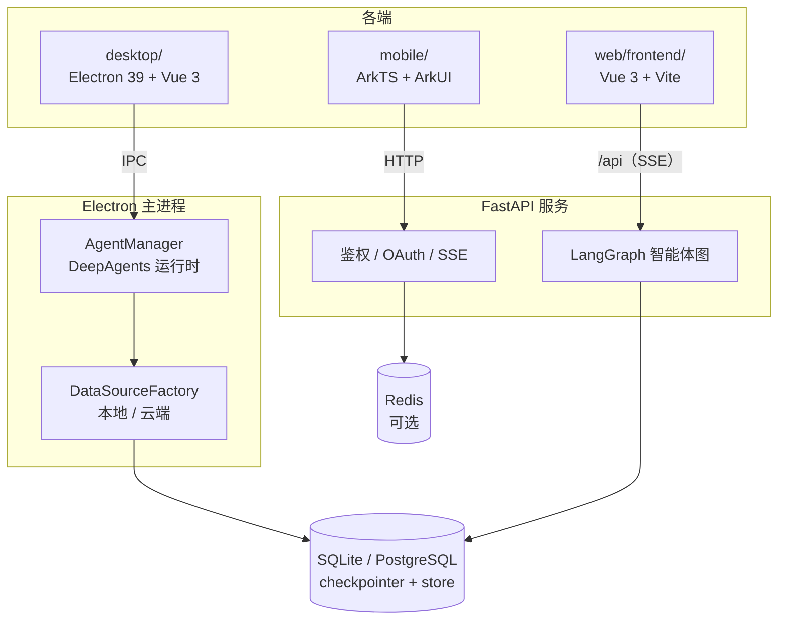

<div align="center">

# WorkMate

**多端 AI 智能体套件 —— 桌面版、移动版与 Web 版，由 DeepAgents 驱动**

[](LICENSE)
[](desktop/)
[](web/frontend/)
[](desktop/)
[](web/backend/)
[](web/backend/)
[](mobile/)
[](https://github.com/langchain-ai/deepagents)

[English](README.md) | **简体中文**

</div>

## 项目简介

WorkMate 是一个单仓库（monorepo）项目，把同一套 AI 智能体体验带到三个平台。所有客户端共享同一基础：由
[DeepAgents](https://github.com/langchain-ai/deepagents) / LangGraph 与 DeepSeek 模型驱动的智能体运行时，支持流式输出、
长期记忆与按会话隔离的工作空间。

- **桌面版** —— 本地优先的 Electron 工作台。对话、记忆与智能体状态保存在本机 SQLite 中；可选的云端模式会在界面保持
  不变的前提下，把底层数据源切换为 PostgreSQL 与远端 HTTP 服务。
- **Web 版** —— 前后端分离应用：Vue 3 单页应用对接 FastAPI 智能体服务，具备登录鉴权、OAuth 登录、验证码与 SSE
  流式输出。
- **移动版** —— 原生 HarmonyOS 应用，基于 Stage 模型、使用纯 ArkTS/ArkUI 编写，运行时零第三方依赖。

各端分别维护自己的 README、`AGENTS.md` 约定与工具链，因此可以只针对其中一个端开发，无需构建整个仓库。

## 目录

- [各端一览](#各端一览)
- [功能亮点](#功能亮点)
- [架构](#架构)
- [技术栈](#技术栈)
- [仓库结构](#仓库结构)
- [快速开始](#快速开始)
- [环境变量配置](#环境变量配置)
- [测试](#测试)
- [相关文档](#相关文档)
- [路线图](#路线图)
- [参与贡献](#参与贡献)
- [许可证](#许可证)

## 各端一览

| 路径 | 平台 | 说明 |
| --- | --- | --- |
| [`desktop/`](desktop/) | Windows / macOS / Linux | **KE-WORK** 桌面端 AI 工作台 —— Electron 39 + Vue 3 + DeepAgents，本地优先（SQLite），可选 PostgreSQL 云端模式 |
| [`web/frontend/`](web/frontend/) | 浏览器 | **Ke Hermes** Web 前端 —— Vue 3 + Vite + Element Plus + Pinia，支持国际化与 SSE 流式对话 |
| [`web/backend/`](web/backend/) | 服务端 | **Ke Hermes** 智能体后端 —— FastAPI + LangGraph + DeepSeek，JWT/RSA 鉴权与 OpenSandbox 沙箱工具 |
| [`mobile/`](mobile/) | HarmonyOS | **KE-WORK** 移动端应用 —— Stage 模型 + ArkTS + ArkUI，SDK 6.1.0（API 23） |

## 功能亮点

**共享智能体内核**

- [DeepAgents](https://github.com/langchain-ai/deepagents) / LangGraph 运行时，接入 DeepSeek 模型，支持流式 token
  与实时"思考"事件。
- 短期记忆由 LangGraph checkpointer 承担、长期记忆由 store 承担：本地为 SQLite，云端模式为 PostgreSQL。
- 智能体配置（模型、系统提示词、技能、记忆文件、子智能体、工具、权限、输出格式）向用户开放，而非写死在代码里。

**桌面版**

- 本地优先：应用数据位于 `~/.ke-work`，工作空间文件默认位于 `~/KeWork`。
- 双工作模式 —— **本地模式**（SQLite）与**云端模式**（PostgreSQL checkpointer/store + 远端 HTTP API）—— 在仓储抽象
  之下切换，变化的只有数据源。
- 工作空间与会话绑定，并由主进程权威解析，伪造 ID 无法劫持会话。
- 密钥经 Electron `safeStorage` 加密存储，密码使用 bcrypt 哈希，受保护的 IPC 路由统一经主进程会话校验。
- 使用 `electron-builder` 打包（NSIS / DMG / AppImage + deb + snap），通过 `electron-updater` 完成更新。

**Web 版**

- 基于 SSE 的实时对话，并提供非流式回退方案。
- JWT 鉴权，配合 bcrypt 哈希与 RSA-2048 加密传输密码；支持手机号（短信）与邮箱注册，GitHub、Google、微信 OAuth
  登录，以及滑块验证码。
- 可配置的登录失败锁定与短信频率限制；Redis 存储，缺省自动降级为内存实现。
- 通过 `vue-i18n` 提供多语言界面。

**移动版**

- 完全自研的 ArkUI 设计体系：动画引导页、手机号登录、聊天页（含手写 Markdown 渲染器）、可拖拽侧边栏抽屉，以及系统
  浅色/深色主题。
- 严格五层单向依赖（`pages → components → store → services → common`），仅靠一个 `USE_MOCK` 常量即可在 Mock 与真实
  服务之间切换。

## 架构

三端共享同一套智能体概念，但运行方式不同：桌面版把智能体运行在主进程里，Web 版把它放在 HTTP API 之后，移动版则通过
HTTP 访问同样的服务。


关键设计点：

- **仓储模式** —— 业务服务只依赖接口（`IAuthRepository`、`IConfigRepository` 等），由工厂注入 SQLite 或云端实现，
  应用其余部分与具体存储无关。
- **主进程权威** —— 会话有效性、工作空间解析与智能体执行全部发生在 Electron 主进程；渲染层只传 ID，不传路径或权限。
- **服务层只暴露接口** —— 页面永远不直接访问具体数据源，因此 Mock/真实、本地/云端的切换不会触碰界面层。

## 技术栈

| 分层 | 桌面版 | Web 版 | 移动版 |
| --- | --- | --- | --- |
| 外壳 / 运行时 | Electron 39、electron-vite、electron-builder、electron-updater | 浏览器单页应用 | HarmonyOS Stage 模型、`@kit.*` API |
| 语言 | TypeScript 5.9 | TypeScript 5.5（前端）、Python 3.11+（后端） | ArkTS |
| 界面 | Vue 3、Pinia、Vue Router、marked | Vue 3、Vite 5、Element Plus、Pinia、ECharts、vue-i18n | ArkUI 声明式、V1 + V2 状态管理 |
| AI 引擎 | DeepAgents 1.11、LangChain、`@langchain/deepseek` | DeepAgents / LangGraph、DeepSeek LLM | HTTP 客户端调用智能体服务 |
| 存储 | better-sqlite3、LangGraph SqliteSaver/SqliteStore | SQLAlchemy async + SQLite/PostgreSQL、Redis（可选） | `@kit.ArkData` Preferences |
| 安全 | bcryptjs、jsonwebtoken、Electron `safeStorage` | JWT（HS256）、bcrypt、RSA-2048 | 系统选择器，无敏感权限 |
| 测试 | Vitest、Playwright | pytest、ruff、mypy / Vitest | `@ohos/hypium`、`@kit.TestKit` |

## 仓库结构

```
workmate/
├── desktop/                    # Electron 桌面端（ke-work）
│   ├── src/main/               # 智能体运行时、IPC、数据源、安全
│   ├── src/preload/            # contextBridge 桥接，暴露 window.api
│   ├── src/renderer/           # Vue 3 + Pinia 界面
│   └── tests/                  # unit / integration / security / e2e
├── mobile/                     # HarmonyOS 端
│   ├── AppScope/               # 应用级配置
│   └── entry/src/main/ets/     # pages / components / services / store / common
├── web/
│   ├── frontend/               # Vue 3 + Vite + Element Plus
│   └── backend/                # FastAPI + LangGraph（uv 管理）
├── AGENTS.md                   # 仓库约定
└── LICENSE                     # Apache-2.0
```

## 快速开始

### 环境要求

| 工具 | 版本 | 适用端 |
| --- | --- | --- |
| [Node.js](https://nodejs.org/) | ≥ 20.19（Vite 7 / Electron 39 要求） | `desktop/`、`web/frontend/` |
| npm | 随 Node.js 附带 | `desktop/`、`web/frontend/` |
| [Python](https://www.python.org/) + [uv](https://docs.astral.sh/uv/) | Python ≥ 3.11 | `web/backend/` |
| [DevEco Studio](https://developer.huawei.com/consumer/cn/deveco-studio/) | 6.x，搭配 HarmonyOS SDK API 23 | `mobile/` |

### 桌面版

```bash
cd desktop
npm install
cp .env.sample .env     # 填入 DEEPSEEK_API_KEY（PowerShell：Copy-Item .env.sample .env）
npm run dev
```

使用 `npm run build:win`、`npm run build:mac` 或 `npm run build:linux` 生成安装包。完整说明（`better-sqlite3` 原生
绑定、可用脚本、测试分层与架构细节）见 [`desktop/README.zh-CN.md`](desktop/README.zh-CN.md)。

### Web 版

后端与前端以两个进程运行：

```bash
# 终端 1 —— 智能体服务
cd web/backend
cp .env.example .env    # 填入 DEEPSEEK_API_KEY
uv sync
uv run python run.py    # http://127.0.0.1:8001

# 终端 2 —— Web 界面
cd web/frontend
npm install
npm run dev             # http://localhost:5173，/api 代理到后端
```

详细说明见 [`web/README.zh-CN.md`](web/README.zh-CN.md) 与 [`web/backend/README.md`](web/backend/README.md)。

### 移动版

1. 用 DevEco Studio 6.x 打开 `mobile/` 目录。
2. 等待其同步 `oh-package.json5`（仅开发依赖：`@ohos/hypium`、`@ohos/hamock`）。
3. 选择 `entry` 模块，在 HarmonyOS 5.0+ 模拟器或真机上运行。

开箱即处于 Mock 模式（`Constants.USE_MOCK = true`），无需后端即可体验全部功能。完整构建与测试流程见
[`mobile/README.zh-CN.md`](mobile/README.zh-CN.md)。

## 环境变量配置

各端读取各自的环境变量文件。**请勿提交 `.env` 文件、密钥与构建产物。**

**桌面版** —— `desktop/.env`（模板：`desktop/.env.sample`）

| 变量 | 是否必需 | 说明 |
| --- | --- | --- |
| `DEEPSEEK_BASE_URL` / `DEEPSEEK_API_KEY` | ✅ | 智能体使用的 DeepSeek 模型地址与密钥 |
| `CLOUD_API_BASE_URL` | 仅云端模式 | 远端服务的基础地址 |
| `CLOUD_POSTGRES_CONN_STRING` | 仅云端模式 | checkpointer 与 store 使用的 PostgreSQL 连接串 |
| `LANGSMITH_TRACING` / `LANGSMITH_API_KEY` | 可选 | LangSmith 可观测性 |

**Web 后端** —— `web/backend/.env`（模板：`web/backend/.env.example`）

| 变量 | 是否必需 | 说明 |
| --- | --- | --- |
| `DEEPSEEK_API_KEY` | ✅ | DeepSeek API 密钥 |
| `DEEPSEEK_MODEL` / `DEEPSEEK_BASE_URL` | 可选 | 模型名称与接口地址 |
| `DATABASE_URL` | 可选 | SQLAlchemy async 数据库地址（默认为 SQLite） |
| `REDIS_URL` | 可选 | 缓存后端（缺省自动降级为内存实现） |
| `JWT_SECRET_KEY` | 可选 | JWT 签名密钥；留空时自动生成并持久化 |

**Web 前端** —— `web/frontend/.env`

| 变量 | 默认值 | 说明 |
| --- | --- | --- |
| `VITE_API_BASE_URL` | `/api` | API 基础路径 |
| `VITE_ALLOW_PASTE_PASSWORD` | — | 是否允许在密码框内粘贴 |

## 测试

| 子项目 | 命令 | 覆盖范围 |
| --- | --- | --- |
| `desktop/` | `npm test` | 单元、集成与安全测试（Vitest） |
| `desktop/` | `npm run test:e2e` | 针对构建产物的 Playwright 端到端测试 |
| `web/backend/` | `uv run pytest` | 接口、智能体与数据库测试 |
| `web/backend/` | `uv run ruff check .` · `uv run mypy --strict src/` | 静态检查与严格类型检查 |
| `web/frontend/` | `npm test` · `npm run type-check` | Vitest 与 `vue-tsc` |
| `mobile/` | `hvigorw entry/src/test --mode module -p product=default` | `@ohos/hypium` 单元测试 |

桌面版 e2e 测试通过 `KE_WORK_HOME` 与 `KE_WORK_USER_DATA` 隔离到临时目录，不会触碰你的真实数据。

## 相关文档

| 文档 | 内容 |
| --- | --- |
| [`desktop/README.zh-CN.md`](desktop/README.zh-CN.md) · [English](desktop/README.md) | 桌面版功能、脚本、架构与打包 |
| [`web/README.zh-CN.md`](web/README.zh-CN.md) · [English](web/README.md) | Web 版概览、架构与环境变量 |
| [`web/backend/README.md`](web/backend/README.md) | 后端启动方式、接口与智能体配置 |
| [`mobile/README.zh-CN.md`](mobile/README.zh-CN.md) · [English](mobile/README.md) | HarmonyOS 应用结构、构建与测试流程 |
| [`AGENTS.md`](AGENTS.md) | 仓库约定与各子项目规则 |

## 路线图

- [ ] 打通桌面版、Web 版与移动版的账号与工作空间同步
- [ ] 移动版：持久化会话 token 以支持"保持登录"、接入真实语音输入、准备发布签名与 AppGallery 上架
- [ ] 桌面版：完善知识库索引与检索能力

## 参与贡献

1. 动手前先阅读目标子项目的 `AGENTS.md` —— 其中记录了该端的技术栈、命令与约定。
2. 新建功能分支，保持提交聚焦。
3. 遵循既有代码风格：JavaScript 项目使用 ESLint + Prettier + TypeScript 严格检查，Python 后端使用 ruff
   （Google 风格 docstring）+ mypy strict。
4. 对改动的每个子项目运行类型检查、静态检查与测试。
5. 行为变更需同步补充测试；桌面端 UI 改动需补充 Playwright 用例。

仓库级约定：问题、文档与提交信息以中文为主；切勿提交密钥、`.env` 文件、依赖目录与构建产物。

## 许可证

本项目基于 [Apache License 2.0](LICENSE) 发布。Web 后端另附有独立的 [MIT 许可证](web/backend/LICENSE)。

---

<div align="center">

**WorkMate** —— 一个智能体，三个平台。

</div>