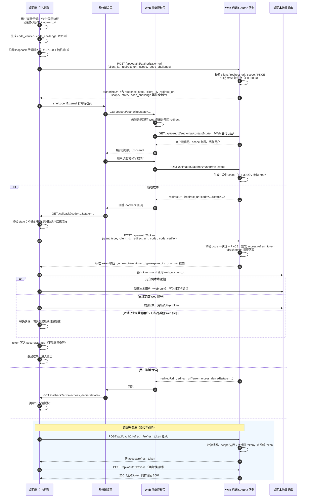

# 桌面端 OAuth2 登录方案（云端工作模式）

## 一、背景与目标

桌面版登录页提供“本地工作”和“云端工作”两种模式。当前“云端工作”仅切换数据源模式，登录表单仍走验证码 / 密码 / 微信，未与 Web 版账号体系打通。

目标业务流：

1. 登录页选择“云端工作”。
2. 显示：LOGO + “WorkMate Web登录”，换行显示“请先阅读并同意《服务条款》和《隐私协议》”，再换行显示“同意”按钮。
3. 点击“同意”后，打开系统浏览器跳转到 Web 版的 OAuth2 授权页面。
4. 授权通过后，检查桌面版是否已有该 Web 版用户：
   - 已有 → 做账号关联处理；
   - 没有 → 在桌面版新建该用户。
5. 登录成功，进入主页。

本文档描述该流程的 OAuth2 规范审查结论、现状差距与分阶段实现方案。

## 二、业务流程与 OAuth2 规范审查

### 2.1 流程与规范的对应关系

| 业务步骤 | OAuth2 对应 | 结论 |
| --- | --- | --- |
| 登录页选择“本地工作 / 云端工作” | 产品层概念，不在 OAuth2 规范内 | 无合规问题 |
| 云端模式展示协议并点击“同意” | 产品/法律层同意（服务条款、隐私协议） | 规范不约束，需与 OAuth2 授权区分 |
| 点击同意 → 系统浏览器打开 Web 授权页 | RFC 6749 授权端点 + RFC 8252 原生应用规范 | 符合，且是推荐做法 |
| 授权通过 → 检查本地是否已有该 Web 用户 → 关联或新建 → 登录成功 | 账号关联是业务逻辑 | 可行，但身份来源与安全边界需明确定义 |

### 2.2 已符合规范的部分（项目现状）

- **Authorization Code + PKCE（S256）**：桌面客户端为 public client，Web 后端强制要求 PKCE（`web/backend/src/api/oauth2/oauth2_service.py` 中 `PKCE is required for public clients`），符合 RFC 7636。
- **loopback 回调**：`http://127.0.0.1:{port}/callback` 只监听 127.0.0.1 随机端口，符合 RFC 8252 §7.3（`desktop/src/main/skills/DesktopOAuthCallbackServer.ts`）。
- **state 防 CSRF**：生成、缓存、回调校验链路完整。
- **redirect_uri 严格匹配**：注册模式 + 完整正则匹配，拒绝 fragment（`web/backend/src/api/oauth2/client_service.py`）。
- **授权码一次性、短 TTL**：state 600 秒、code 300 秒，兑换后立即删除。
- **token 由桌面主进程直连后端换取**，不经浏览器，不暴露给渲染层。
- **Web 授权页负责身份认证 + consent**：未登录先跳 Web 登录，登录后展示客户端名称与请求权限（`web/frontend/src/views/OAuth2AuthorizeView.vue`）。

### 2.3 两个“同意”的区分

- 桌面端“同意《服务条款》《隐私协议》”属于产品契约层，OAuth2 规范不约束；建议本地记录同意版本与时间。
- Web 授权页的“授权”按钮才是 OAuth2 的 consent（scope 授权）。

两者都要保留，实现上分开记录：桌面端记本地协议同意记录，Web 端走标准 OAuth2 授权页。

### 2.4 授权 URL 标准参数

当前流程先 `POST /api/oauth2/authorization-url` 拿到 `authorizeUrl`（只含 `state`），client_id、redirect_uri、scope、code_challenge 全部绑定在服务端缓存中。安全上等价（state 为不透明句柄），但与 RFC 6749 §4.1.1 的授权端点参数形式（`response_type=code`、`client_id`、`redirect_uri`、`scope`、`state`）及 RFC 7636 §4.3 的 PKCE 参数（`code_challenge`、`code_challenge_method`）字面不一致。建议将标准参数显式拼入授权 URL，便于调试、审计与标准工具兼容，同时保留服务端 state 绑定校验（双保险）。

### 2.5 账号关联的安全边界

OAuth 授权通过后，Web 用户必然已存在（否则拿不到 token），`token.user.id` 就是权威身份。真正的检查是：**桌面本地数据库是否已有绑定到该 `webAccountId` 的本地用户**。

安全要求：

- 身份判断只使用 token 响应中的 `user.id`，不信任用户表单输入。
- 本地用户与 Web 账号建议 1:1 绑定；本地已登录用户与刚授权的 Web 账号不一致时，必须显式确认，禁止静默换绑或合并。
- “本地已登录其他用户 + Web 账号未绑定任何本地用户”不属于换绑：应新建该 Web 账号的本地用户并切换登录（用户确认），与“换绑”分支区分处理，避免语义混淆。
- 同一 Web 账号可在多设备登录，Web 端允许多个 refresh token，不做 `(client_id, user_id)` 唯一约束。

### 2.6 OAuth2 认证流程图



说明：流程图覆盖授权（同意 → PKCE → 授权页 consent → 回跳 → 换 token → 账号关联）、刷新（轮换 + 族撤销）、登出（撤销 refresh token）三个阶段；与第七、八章的实现要求一一对应。

## 三、现状与差距

### 3.1 已具备的能力

- Web 后端通用 OAuth2 服务：`/api/oauth2/authorization-url`、`/authorize/context`、`/authorize/approve`、`/token`。
- 桌面端 OAuth2 客户端能力：PKCE 生成、loopback 回调、token 安全存储、刷新（`desktop/src/main/skills/SkillSyncService.ts`）。
- 客户端注册：`ke-work-desktop`（public、authorization_code、PKCE 必需），见 `web/backend/src/db/seeds/oauth2_clients_seed.json`。
- 设计文档：`web/backend/docs/Ke-Hermes-OAuth2授权方案.md`；技能同步对接：`desktop/docs/桌面版与WEB版对接方案.md`。

### 3.2 差距清单

| 差距 | 现状 | 位置 |
| --- | --- | --- |
| 桌面 OAuth2 依赖已登录用户 | `authorize(localUserId)` 需先有本地用户，IPC 层 `session.requireUserId()` | `desktop/src/main/skills/SkillSyncService.ts`、`desktop/src/main/ipc/skill-sync-handlers.ts` |
| 登录页无 Web 登录入口 | “云端工作”仅切换数据源，表单仍为验证码/密码/微信，无协议同意 UI | `desktop/src/renderer/src/views/Login.vue` |
| 本地无 Web 身份关联字段 | `users` 表只有 username / mobile / wechat_openid | `desktop/src/main/database/local/migrations.ts` |
| scope 不足 | `ke-work-desktop` 仅允许 `skill:read`，云端模式需要用户资料、agent、会话等 | `web/backend/src/db/seeds/oauth2_clients_seed.json` |
| 无 OAuth2 专用刷新/撤销 | 刷新走 Web 通用 `/api/auth/refresh`，不区分客户端、无轮换 | `web/backend/src/api/auth/service.py` |
| 授权页 URL 配置 | 已使用正式配置项 `OAUTH2_FRONTEND_URL`（默认 `http://localhost:5173`），无 `settings.n` 问题 | `web/backend/src/api/oauth2/oauth2_service.py`、`web/backend/src/agent/config/config.py` |
| token 响应字段非标准 | 返回 `accessToken` 等 camelCase，缺少 RFC 6749 §5.1 的 `token_type`；错误响应未按 §5.2 返回 `error` 码 | `web/backend/src/api/oauth2/oauth2_schemas.py`、`oauth2_service.py` |
| refresh token 无重用检测 | 轮换后旧 token 再次使用仅返回失败，未做族撤销；刷新无 scope 边界校验 | `web/backend/src/api/oauth2/oauth2_service.py` |
| 登出后 access token 仍有效 | 无状态 JWT 在剩余 TTL 内仍可访问资源，撤销 refresh token 无法即时失效 | `web/backend/src/core/security.py` |
| 回调服务器可被探测中断 | 任一不匹配请求即结束授权流程（先到先得 race） | `desktop/src/main/skills/DesktopOAuthCallbackServer.ts` |
| loopback 注册含 localhost 变体 | RFC 8252 §7.3 建议仅使用 IP 字面量 | `web/backend/src/db/seeds/oauth2_clients_seed.json` |
| 云端存储拓扑未定义 | 切换云端模式依赖本地 `CLOUD_POSTGRES_CONN_STRING` 直连 Postgres | `desktop/tests/e2e/login.e2e.ts`（E2E-03） |

## 四、总体方案

### 4.1 分层结构

```text
桌面端渲染层 Login.vue
   │  window.api.auth.loginByOAuth2() / oauth2.refresh() / auth.logout()
   ▼
桌面端 preload（contextBridge）
   ▼
桌面端主进程
   ├── OAuth2ClientService（抽离自 SkillSyncService，支持登录前调用）
   │     ├── PKCE 生成
   │     ├── DesktopOAuthCallbackServer（loopback 回调）
   │     ├── 调用 /api/oauth2/authorization-url、/token、/refresh、/revoke
   │     └── secureStorage 保存 token
   ├── AuthService.loginByOAuth2（账号关联：查/建本地用户、写会话）
   ├── SessionService（localUserId + webAccountId）
   └── WorkModeStore / DataSourceFactory（云端数据源切换）
   ▼
Web 后端（OAuth2 授权服务 + 业务接口）
   └── Web 前端通用授权页 /oauth2/authorize
```

### 4.2 关键决策（需确认，见第十章）

- 云端模式存储拓扑：桌面直连服务器 PostgreSQL，还是全部走 Web HTTP API。
- 本地用户与 Web 账号绑定策略：默认按 1:1 + 显式确认设计。

## 五、Web 后端改动（阶段 1）

### 5.1 授权页 URL 配置（已验证）

经核对，`oauth2_service.py` 已使用正式的 `settings.OAUTH2_FRONTEND_URL`，`config.py` 已定义对应配置项（支持环境变量覆盖，默认开发环境 `http://localhost:5173`），历史代码中不存在 `settings.n`。本项无需改动，仅需在 `.env.example` 中补充示例。

### 5.2 扩展桌面客户端 scope

按云端模式实际接口清单扩展 `ke-work-desktop` 的 `allowed_scopes`，建议：

| Scope | 说明 |
| --- | --- |
| `user:read`（或 `profile`） | 读取用户资料（昵称、头像） |
| `agent:read` | 读取智能体配置 |
| `conversation:read` | 读取会话 |
| `conversation:write` | 创建和修改会话 |
| `workspace:read` | 读取工作区 |

同时保留 `skill:read`，保证技能同步不受影响。

### 5.3 OAuth2 专用刷新与撤销

新增：

- `POST /api/oauth2/refresh`：`grant_type=refresh_token`，实现 refresh token 轮换（签发新 token 并撤销旧 token）。
- `POST /api/oauth2/revoke`：撤销指定 refresh token。

实现 `oauth2_refresh_tokens` 表（设计见 `web/backend/docs/Ke-Hermes-OAuth2授权方案.md`）：

- `token_hash` 存摘要（SHA-256），不存明文。
- 轮换时先撤销旧记录再插入新记录，旧 token 一次性使用。
- 同一 `(client_id, user_id)` 允许多条记录（多设备）。
- 增加 `family_id` 关联同一授权链；同一族内任一 token 被重用（已撤销/已轮换后再次提交）时，撤销该族全部 token 并告警（RFC 9700 §4.14.2 族撤销）。
- 刷新请求省略 `scope` 时保持原授权 scope；显式携带时只允许收窄、禁止扩大，且不得超出客户端 `allowed_scopes`（RFC 6749 §6）。
- 刷新与轮换需处理并发竞态：同族两个并发刷新只有一个成功，另一个返回新 token 或幂等结果；桌面主进程内串行化刷新。
- `revoke` 对无效、已撤销或未知 token 一律返回 200，不泄露 token 有效性（RFC 7009 §2.2）；支持可选 `token_type_hint`。

与 Web 通用会话刷新（`/api/auth/refresh`）分离，避免混淆客户端身份与 scope。

边界说明：access token 为无状态 JWT，登出/换绑撤销 refresh token 后，已签发的 access token 在剩余 TTL 内仍可访问资源；如需即时失效，需引入 token 黑名单或签发版本号（列入阶段 4 可选加固项）。

### 5.4 授权 URL 携带标准参数

`authorizeUrl` 显式包含 `response_type=code`、`client_id`、`redirect_uri`、`scope`、`state`、`code_challenge`、`code_challenge_method`（RFC 6749 §4.1.1 + RFC 7636 §4.3）；服务端仍按 state 绑定校验，双保险。

说明：标准做法下授权 URL 由客户端自行构造，`/authorization-url` 是服务端辅助接口。建议客户端保留独立构造授权 URL 的能力（参数齐全），辅助接口仅做参数预校验与 state 生成；服务端以 state 缓存的绑定关系为最终校验依据。

### 5.5 token 响应字段标准化

token 响应补充 RFC 6749 §5.1 标准字段：

```json
{
  "access_token": "...",
  "token_type": "Bearer",
  "expires_in": 7200,
  "refresh_token": "...",
  "scope": "user:read agent:read conversation:read conversation:write"
}
```

可保留 `user` 扩展字段返回 `WebUser` 摘要（id、nickname、avatar）。

token 端点错误响应按 RFC 6749 §5.2 标准化（当前为 HTTP 400 + 自定义 `detail`，需改造）：

```json
{
  "error": "invalid_grant",
  "error_description": "code 无效或已过期"
}
```

错误码映射：参数缺失/格式错误 → `invalid_request`；code/refresh token 无效、过期、已撤销、client 不匹配 → `invalid_grant`；grant_type 不支持 → `unsupported_grant_type`；客户端无权使用该授权方式 → `unauthorized_client`；scope 越权 → `invalid_scope`。桌面端按 `error` 码分流文案（`access_denied` → “已取消授权”等）。

### 5.6 资源接口 scope 校验

`get_current_user_id` 目前只校验 token 有效性，不校验 scope。建议新增依赖（如 `require_scope("conversation:read")`），在会话、智能体等资源接口按需启用，access token 的 `scope` claim 已存在（`core/security.create_token_pair` 写入）。

需明确第一方 token 的边界：Web 登录签发的 access token 没有 `scope`/`client_id` claim。建议策略为：

- OAuth2 客户端 token（含 `client_id` claim）必须携带 `scope`，资源接口按 scope 校验；
- Web 第一方 token 按自身登录态放行，或显式收敛为最小特权并同样走 scope 校验（二选一，需统一）；
- access token 建议增加 `aud`（资源服务器标识），资源接口同时校验 `sub + aud + scope`，防止某客户端 token 被另一客户端冒用（RFC 9700 §4.3.2 方向）。

## 六、桌面端改动（阶段 2）

### 6.1 抽离通用 OAuth2ClientService

从 `desktop/src/main/skills/SkillSyncService.ts` 抽离：

```text
desktop/src/main/oauth2/
├── OAuth2ClientService.ts   # PKCE、授权、换 token、刷新、撤销、token 存取
├── DesktopOAuthCallbackServer.ts  # 从 skills 目录迁入（或复用）
└── types.ts
```

要求：

- 支持登录前调用（无本地用户），授权结果返回 `{ webUser, tokens }`。
- `SkillSyncService` 改为依赖该服务，token key 前缀区分用途（`skill-sync:` 与 `oauth2-session:`）。
- 回调服务器保持只监听 `127.0.0.1` 随机端口、只处理 `/callback`、校验 state、完成后关闭。

### 6.2 本地数据库迁移

新增迁移版本：

```text
ALTER TABLE users ADD COLUMN web_account_id TEXT UNIQUE;
ALTER TABLE users ADD COLUMN web_nickname TEXT;
ALTER TABLE users ADD COLUMN web_avatar TEXT;
ALTER TABLE users ADD COLUMN web_linked_at INTEGER;

CREATE TABLE IF NOT EXISTS oauth2_sessions (
  id              TEXT PRIMARY KEY,
  local_user_id   TEXT NOT NULL REFERENCES users(id) ON DELETE CASCADE,
  web_account_id  TEXT NOT NULL,
  scope           TEXT NOT NULL DEFAULT '',
  expires_at      INTEGER,
  created_at      INTEGER NOT NULL,
  updated_at      INTEGER NOT NULL
);
CREATE INDEX IF NOT EXISTS idx_oauth2_sessions_web ON oauth2_sessions(web_account_id);
```

`IAuthRepository` 增加 `findByWebAccountId`、`linkWebAccount` 等接口，`LocalAuthRepository` 实现，`CloudAuthRepository` 保持 no-op。

补充说明：

- `users` 增加显式 `is_web_only` 标志（在随机口令之外明确标记），web-only 用户禁止走密码/验证码登录路径。
- `username = web_<webAccountId>` 需校验长度与字符集，冲突由 `UNIQUE` 约束兜底并返回明确错误。
- `oauth2_sessions` 仅作绑定索引，token 权威在 secureStorage；登出/换绑/撤销时两处必须同步清理，避免残留会话与残留 token 不一致。
- 存量迁移：已有 skill-sync 授权的用户，迁移时按 `token.user.id` 回填 `web_account_id` 并生成正式 oauth2 会话；同一 Web 账号已存在绑定或重复授权时，走 7.3 的确认分支，不静默覆盖。

### 6.3 token 安全存储

沿用 `secureStorage`（safeStorage 加密），key 设计：

```text
oauth2-session:{localUserId}:tokens
```

内容：

```json
{
  "accessToken": "...",
  "refreshToken": "...",
  "expiresAt": 1234567890,
  "webAccountId": "...",
  "webNickname": "...",
  "webAvatar": "...",
  "scope": "..."
}
```

token 不暴露给渲染层。

safeStorage 降级策略：Electron `safeStorage.isEncryptionAvailable()` 在 Linux 无系统钥匙串时可能为 false（明文落盘）。策略：不可用时不写入 refresh token，登录流程给出明确提示；或在首次启动时引导配置系统钥匙串。禁止在未加密状态下静默保存 token。

### 6.4 IPC 与 preload

新增：

| 通道 | 说明 |
| --- | --- |
| `auth:login-oauth2` | 启动 OAuth2 授权流程，返回 `{ user, webUser }` |
| `oauth2:status` | 查询当前本地用户与 Web 账号的绑定状态 |
| `oauth2:refresh` | 刷新 access token（主进程内部调用，可先不暴露给渲染层） |
| `auth:logout` | 登出时撤销 refresh token 并清理本地会话 |

在 `desktop/src/preload/index.d.ts` 的 `KeWorkWindowApi` 中新增 `loginByOAuth2`、`getOAuth2Status`。

### 6.5 会话与模式联动

- `SessionService` 支持同时记录 `localUserId` 与 `webAccountId`。
- 云端工作模式下受保护 IPC 沿用 `session.requireUserId()`。
- 模式切换语义：切到云端且未授权时提示先登录；切回本地时保留本地数据，不清除 Web 绑定（由用户显式解绑）。

## 七、登录页 UI 与账号关联（阶段 3）

### 7.1 登录页 UI

“云端工作”选中后，表单区替换为：

```text
LOGO
WorkMate Web登录
请先阅读并同意《服务条款》和《隐私协议》
[同意]
```

- 《服务条款》《隐私协议》为可点击链接，打开 Web 端协议页面。
- “同意”点击后记录本地同意记录（协议版本 + 时间），然后进入 OAuth2 授权流程。
- 协议未同意时“同意”按钮可置灰或点击后先展示协议弹窗。

### 7.2 点击同意后的主进程流程

1. 生成 `code_verifier` / `code_challenge`（S256）。
2. 启动 loopback 回调服务器。
3. `POST /api/oauth2/authorization-url` 获取授权 URL。
4. `shell.openExternal` 打开系统浏览器。
5. 等待回调，校验 state，捕获 `code` 或 `error`。
6. `POST /api/oauth2/token` 换取 token。
7. 进入账号关联处理（7.3）。

### 7.3 账号关联四分支

以 `token.user.id` 为权威身份，查询本地 `users.web_account_id`：

| 场景 | 处理 |
| --- | --- |
| 本地无任何登录用户，且无绑定 | 新建本地用户（username 用 `web_<webAccountId>`，密码置为随机不可登录口令，标记 web-only），写入绑定与会话，登录成功 |
| 已存在绑定该 Web 账号的本地用户 | 直接以该本地用户登录，更新资料与 token |
| 本地已登录其他用户，且该 Web 账号未绑定任何本地用户 | 新建该 Web 账号的本地用户并切换登录（弹确认框说明会切换当前登录身份），不属于换绑 |
| 该本地用户已绑定其他 Web 账号（或该 Web 账号已绑定其他本地用户） | 弹确认框，明确“切换绑定”的后果（旧 Web 账号 token 撤销、数据边界变化），确认后才允许换绑 |

换绑/解绑需记录审计日志（`oauth2_login`、`oauth2_link`、`oauth2_unlink`、`oauth2_refresh`）。

### 7.4 错误与取消处理

- 用户在授权页取消：捕获 `error=access_denied`，回登录页提示“已取消授权”。
- 其他 OAuth2 错误码（RFC 6749 §4.1.2.1 的 `invalid_request`、`unauthorized_client`、`unsupported_response_type`、`invalid_scope`、`server_error`、`temporarily_unavailable`）：按 `error_description` 映射文案，不直接透传。
- state 校验失败 / 未收到 code：提示“授权失败，请重试”。回调服务器对 state 缺失/不匹配只返回 400、不结束流程，避免本机探测请求中断授权（当前实现会 `settle` 结束，需修复）。
- 授权等待超时（建议 5 分钟）：关闭回调服务器，提示重新操作。
- access token 过期：优先用 refresh token 轮换；刷新失败提示“登录已过期，请重新授权”，不静默清理本地数据。

## 八、安全与合规清单（阶段 4）

- [ ] PKCE S256 强制；state 校验；授权码一次性 + 重用检测（重用撤销已签发 token）。
- [ ] redirect_uri 精确匹配，回调服务器仅监听 127.0.0.1 随机端口；注册表仅保留 IP 字面量变体。
- [ ] 回调服务器对 state 不匹配只拒绝不结束流程。
- [ ] token 只存主进程 secureStorage（safeStorage 不可用时禁止明文落盘），渲染层只拿 WebUser 摘要。
- [ ] 协议同意版本化：记录 `agreed_at` + 协议版本（以 Web 端版本接口为权威），协议更新后需重新同意。
- [ ] 账号关联 1:1，换绑必须显式确认；新建与换绑分支区分。
- [ ] refresh token 轮换 + 族撤销（重用检测）+ scope 边界；`revoke` 对无效 token 返回 200；审计日志覆盖登录、关联、解绑、刷新、重用告警。
- [ ] token 端点错误响应按 RFC 6749 §5.2 返回 `error` 码。
- [ ] 资源接口按 scope + aud 校验；明确 Web 第一方 token 的边界。
- [ ] 环境变量与密钥不入库（`CLOUD_POSTGRES_CONN_STRING`、`WORKMATE_WEB_API_BASE_URL` 等沿用 `.env.sample`）。

## 九、测试计划（阶段 5）

### 9.1 Web 后端

- 扩展 `web/backend/tests/unit_tests/test_oauth2.py`：authorization-url → context → approve → token → refresh（轮换）→ revoke 全链路及异常分支。
- 校验授权 URL 标准参数、scope 越权、redirect_uri 不匹配、PKCE 校验失败、code 复用。
- 补充：code 重用触发 token 族撤销；refresh token 重用触发族撤销；刷新 scope 扩大被拒绝、收窄成功；revoke 无效 token 返回 200；同族并发刷新竞态；token 端点错误响应字段（`error`/`error_description`）断言。

### 9.2 桌面端

- 单测 `OAuth2ClientService`（mock 回调服务器与 HTTP）：授权成功、取消、超时、state 不匹配。
- 单测账号关联四分支：新用户、已关联、已登录其他用户 + 未绑定（新建并切换）、冲突换绑确认。
- 单测 token 刷新与失败回退。
- 补充：回调服务器被本地探测（state 缺失/不匹配）不中断流程；safeStorage 不可用时的降级行为；协议版本更新后需重新同意。

### 9.3 E2E

- 新增：登录页云端模式 → 同意 → 授权页（mock Web 授权）→ 回跳 → 登录成功。
- 更新 `desktop/tests/e2e/login.e2e.ts`：E2E-03 的云端模式回滚用例需与新的 OAuth 登录入口适配。

## 十、待确认决策点

1. **云端模式存储拓扑**：OAuth 登录后，桌面是直连服务器 PostgreSQL（保留现架构，仅将认证换成 OAuth token），还是收敛为全部走 Web HTTP API？影响阶段 2 的数据源改造量。安全分析：直连模式下 OAuth2 的 scope、撤销、审计均无法约束数据库访问，token 只保护 HTTP API；若保留直连，需引入独立 DB 账号与行级安全（RLS）并隔离凭据，否则建议全部走 Web HTTP API（推荐）。
2. **绑定策略**：默认按 1:1 + 显式确认；如需一个本地账号绑定多个 Web 账号（切换式），需调整第七章设计。
3. **scope 范围**：云端模式首期实际开放的接口清单，决定 `allowed_scopes` 与资源接口校验范围。

## 十一、参考文档与文件清单

- 设计依据：`web/backend/docs/Ke-Hermes-OAuth2授权方案.md`
- 技能同步对接：`desktop/docs/桌面版与WEB版对接方案.md`
- Web 后端 OAuth2 服务：`web/backend/src/api/oauth2/`
- Web 前端授权页：`web/frontend/src/views/OAuth2AuthorizeView.vue`
- 桌面端 OAuth2 客户端：`desktop/src/main/skills/SkillSyncService.ts`、`desktop/src/main/skills/DesktopOAuthCallbackServer.ts`
- 桌面端登录页：`desktop/src/renderer/src/views/Login.vue`
- 桌面端数据库迁移：`desktop/src/main/database/local/migrations.ts`
- 认证服务与会话：`desktop/src/main/services/AuthService.ts`、`desktop/src/main/services/SessionService.ts`
