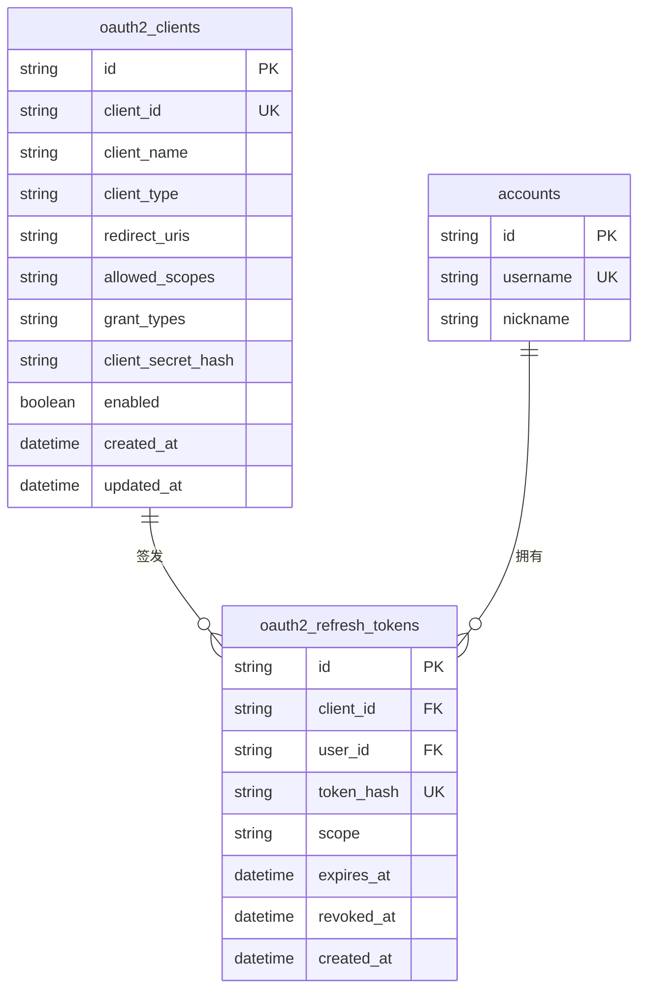

# Ke-Hermes OAuth2 授权方案

## 一、背景与目标

当前 `web/backend/src/api/oauth` 主要面向 GitHub、Google、微信等第三方账号登录，其目标是帮助用户登录 Web 版，而不是作为统一的 OAuth2 授权服务开放给外部客户端。

后续桌面版、移动版以及第三方应用都需要通过统一的方式完成授权，并使用授权获得的 token 调用 Web 后端接口。因此需要新增一套面向客户端授权的 OAuth2 服务。

本文档描述该服务的总体设计、接口、数据模型、安全策略和接入方式。

## 二、术语与角色

| 角色 | 说明 |
| --- | --- |
| Resource Owner | Web 后端资源的最终用户 |
| Client | 请求授权的客户端，如桌面版、移动版、第三方应用 |
| Authorization Server | Web 后端新增的 OAuth2 授权服务 |
| Resource Server | Web 后端现有的业务接口，如技能、智能体、会话等 |
| Access Token | 调用业务接口使用的短期 token |
| Refresh Token | 用于刷新 access token 的长期 token |

## 三、总体设计

### 3.1 设计原则

1. 与现有第三方登录 OAuth 分离。
2. 首期支持 Authorization Code + PKCE，适用于桌面版、移动版、第三方 Web 应用等公共客户端。
3. 客户端信息统一注册，不硬编码单一客户端。
4. 授权码和授权请求使用短 TTL 缓存，降低一次性凭证泄漏风险。
5. Access token 复用现有 JWT 体系，业务接口尽量少改。

### 3.2 模块划分

后端新增模块：

```text
web/backend/src/api/oauth2/
├── __init__.py
├── oauth2_api.py
├── oauth2_service.py
├── oauth2_schemas.py
├── client_service.py
└── scope_service.py
```

Web 前端新增通用授权页：

```text
web/frontend/src/views/OAuth2AuthorizeView.vue
web/frontend/src/services/oauth2Api.ts
```

### 3.3 与现有模块的关系

| 现有模块 | 处理方式 |
| --- | --- |
| `api/oauth` | 保持不变，继续用于 GitHub / Google / 微信登录 |
| `api/auth` | 继续负责账号登录、刷新 token、退出登录 |
| `core/security.create_token_pair` | OAuth2 签发 token 时复用，并扩展携带 client 与 scope 信息 |
| `core/cache` | 用于存储短时授权请求和授权码 |
| `db` | 新增 OAuth2 客户端与可选 refresh token 表 |

## 四、客户端与权限模型

### 4.1 客户端注册

建议新增 `oauth2_clients` 表：

| 字段 | 类型 | 约束 | 说明 |
| --- | --- | --- | --- |
| id | String(36) | PK，非空 | 内部主键，沿用现有项目的 UUID 字符串风格 |
| client_id | String(64) | 唯一，非空 | 对外客户端标识 |
| client_name | String(128) | 非空 | 客户端展示名称 |
| client_type | String(16) | 非空，默认 `public` | `public` / `confidential` |
| redirect_uris | JSON | 非空，默认 `[]` | 允许的回调地址列表 |
| allowed_scopes | JSON | 非空，默认 `[]` | 允许申请的 scope 列表 |
| grant_types | JSON | 非空，默认 `["authorization_code"]` | 允许的 grant type 列表 |
| client_secret_hash | String(255) | 可空 | confidential 客户端密钥摘要，禁止保存明文 |
| description | Text | 默认 `""` | 客户端说明 |
| enabled | Boolean | 非空，默认 `true` | 是否启用 |
| created_at | DateTime | 非空 | 创建时间 |
| updated_at | DateTime | 非空 | 更新时间 |

首期种子数据至少包含桌面端：

```json
{
  "client_id": "ke-work-desktop",
  "client_name": "KE-WORK 桌面版",
  "client_type": "public",
  "redirect_uris": [
    "http://127.0.0.1:{port}/callback",
    "http://localhost:{port}/callback"
  ],
  "allowed_scopes": ["skill:read"],
  "grant_types": ["authorization_code"],
  "enabled": true
}
```

后续移动版客户端可注册类似：

```json
{
  "client_id": "workmate-mobile",
  "client_name": "WorkMate 移动版",
  "client_type": "public",
  "redirect_uris": ["workmate://oauth/callback"],
  "allowed_scopes": ["skill:read", "agent:read"],
  "grant_types": ["authorization_code"],
  "enabled": true
}
```

### 4.2 Scope 设计

首期建议先定义最小权限：

| Scope | 说明 |
| --- | --- |
| `skill:read` | 读取技能列表和技能详情 |
| `skill:write` | 创建、修改、删除技能 |
| `agent:read` | 读取智能体配置 |
| `agent:write` | 修改智能体配置 |
| `conversation:read` | 读取会话 |
| `conversation:write` | 创建和修改会话 |

当前桌面版技能同步只需要 `skill:read`。

### 4.3 数据模型与数据库设计

OAuth2 服务首期只把客户端注册信息和第二阶段需要的 refresh token 记录持久化到数据库；授权请求、授权码等一次性凭证继续使用 `core/cache`，避免把短生命周期数据沉淀到业务库，同时降低泄漏后的影响面。

#### 4.3.1 实体关系



#### 4.3.2 `oauth2_clients` 表

对应 ORM 模型建议放在 `src/db/models/oauth2_client.py`：

```python
import uuid
from datetime import datetime

from sqlalchemy import Boolean, DateTime, JSON, String, Text, func
from sqlalchemy.orm import Mapped, mapped_column

from db.base import Base


class OAuth2Client(Base):
    __tablename__ = "oauth2_clients"

    id: Mapped[str] = mapped_column(
        String(36), primary_key=True, default=lambda: str(uuid.uuid4())
    )
    client_id: Mapped[str] = mapped_column(
        String(64), unique=True, nullable=False, index=True
    )
    client_name: Mapped[str] = mapped_column(String(128), nullable=False)
    client_type: Mapped[str] = mapped_column(
        String(16), nullable=False, default="public"
    )
    redirect_uris: Mapped[list] = mapped_column(JSON, nullable=False, default=list)
    allowed_scopes: Mapped[list] = mapped_column(JSON, nullable=False, default=list)
    grant_types: Mapped[list] = mapped_column(
        JSON, nullable=False, default=lambda: ["authorization_code"]
    )
    client_secret_hash: Mapped[str | None] = mapped_column(
        String(255), nullable=True
    )
    description: Mapped[str] = mapped_column(Text, default="")
    enabled: Mapped[bool] = mapped_column(
        Boolean, nullable=False, default=True, index=True
    )
    created_at: Mapped[datetime] = mapped_column(
        DateTime, server_default=func.now()
    )
    updated_at: Mapped[datetime] = mapped_column(
        DateTime, server_default=func.now(), onupdate=func.now()
    )
```

说明：

- `client_id` 是面向客户端的稳定标识，`id` 只作为内部主键，两者分离，便于外部标识不被内部迁移影响。
- `redirect_uris`、`allowed_scopes`、`grant_types` 采用 JSON 存储，与当前项目已有的 `Tool.tags`、`Conversation.attachment_ids` 等字段风格一致。
- `client_secret_hash` 只保存哈希值。public 客户端保持为空；confidential 客户端在 token 接口认证时复用现有密码哈希能力。

#### 4.3.3 `oauth2_refresh_tokens` 表

对应 ORM 模型建议放在 `src/db/models/oauth2_refresh_token.py`：

```python
import uuid
from datetime import datetime

from sqlalchemy import DateTime, ForeignKey, String, func
from sqlalchemy.orm import Mapped, mapped_column

from db.base import Base


class OAuth2RefreshToken(Base):
    __tablename__ = "oauth2_refresh_tokens"

    id: Mapped[str] = mapped_column(
        String(36), primary_key=True, default=lambda: str(uuid.uuid4())
    )
    client_id: Mapped[str] = mapped_column(
        String(64),
        ForeignKey("oauth2_clients.client_id", ondelete="CASCADE"),
        nullable=False,
        index=True,
    )
    user_id: Mapped[str] = mapped_column(
        String(36),
        ForeignKey("accounts.id", ondelete="CASCADE"),
        nullable=False,
        index=True,
    )
    token_hash: Mapped[str] = mapped_column(
        String(255), unique=True, nullable=False, index=True
    )
    scope: Mapped[str] = mapped_column(String(255), nullable=False)
    expires_at: Mapped[datetime] = mapped_column(
        DateTime, nullable=False, index=True
    )
    revoked_at: Mapped[datetime | None] = mapped_column(DateTime, nullable=True)
    created_at: Mapped[datetime] = mapped_column(
        DateTime, server_default=func.now()
    )

```

说明：

- `token_hash` 保存 refresh token 的摘要，例如 `SHA-256(refresh_token)`，数据库泄漏时无法直接还原有效 token。
- `user_id` 关联现有 `accounts.id`，与当前 `UserOAuth.user_id`、`Conversation.user_id` 保持一致。
- 第二阶段做 refresh token 轮换时，先撤销旧记录再插入新记录，实现旧 token 一次性使用。
- 该表在阶段 1 可以不创建，阶段 2 再随 `grant_type=refresh_token` 一起启用。

#### 4.3.4 短时缓存模型

以下数据结构不建表，由 `core/cache` 以 JSON 字符串保存，并设置短 TTL：

| 缓存键 | 对应数据 | 建议 TTL | 使用方式 |
| --- | --- | --- | --- |
| `oauth2:state:{state}` | OAuth2AuthorizationRequest | 600 秒 | 授权页加载、确认授权 |
| `oauth2:code:{code}` | OAuth2AuthorizationCode | 300 秒 | token 接口一次性兑换 |

OAuth2AuthorizationRequest：

```json
{
  "client_id": "ke-work-desktop",
  "client_name": "KE-WORK 桌面版",
  "redirect_uri": "http://127.0.0.1:54821/callback",
  "scopes": ["skill:read"],
  "code_challenge": "...",
  "code_challenge_method": "S256",
  "created_at": 1234567890,
  "expires_at": 1234568490
}
```

OAuth2AuthorizationCode：

```json
{
  "code": "...",
  "state": "...",
  "client_id": "ke-work-desktop",
  "redirect_uri": "http://127.0.0.1:54821/callback",
  "user_id": "...",
  "scopes": ["skill:read"],
  "code_challenge": "...",
  "code_challenge_method": "S256",
  "created_at": 1234567890,
  "expires_at": 1234568190
}
```

#### 4.3.5 索引与约束

`oauth2_clients`：

- `PK(id)`
- `UK(client_id)`
- `IX(client_id)`，用于按外部标识查询客户端
- `IX(enabled)`，用于过滤启用状态

`oauth2_refresh_tokens`：

- `PK(id)`
- `UK(token_hash)`，用于 token 查询和防重复
- `IX(client_id)`、`IX(user_id)`，用于查询某客户端或某用户的授权记录
- `IX(expires_at)`，用于清理过期 token

同一客户端、同一用户可以存在多条 refresh token 记录，例如用户同时在桌面版和移动版登录，因此不在 `(client_id, user_id)` 上强制唯一约束。

## 五、授权码 + PKCE 流程

### 5.1 流程步骤

1. 客户端生成 PKCE：
   - `code_verifier`
   - `code_challenge = BASE64URL(SHA256(code_verifier))`
2. 客户端准备 `redirect_uri`，桌面版为 `http://127.0.0.1:{random_port}/callback`。
3. 客户端调用后端创建授权请求。
4. 后端生成 `state`，缓存授权请求，返回浏览器授权页 URL。
5. 客户端打开浏览器，用户登录并确认授权。
6. Web 前端调用后端授权上下文接口展示客户端信息、用户信息与请求权限。
7. 用户点击“授权”，前端调用授权确认接口。
8. 后端校验 state，生成一次性 `code`，返回带 code 的 `redirectUrl`。
9. 浏览器跳转到客户端 `redirect_uri`。
10. 客户端捕获 code，调用 token 接口，使用 `code_verifier` 完成 PKCE 校验。
11. 后端校验通过后签发 token。

### 5.2 流程图

```text
客户端
  │
  ├─ 生成 code_verifier / code_challenge
  ├─ POST /api/oauth2/authorization-url
  ├─ 打开浏览器
  │
  ▼
Web 前端 /oauth2/authorize
  │
  ├─ 如未登录，跳转登录并携带 redirect
  ├─ GET /api/oauth2/authorize/context
  ├─ 用户点击授权
  ├─ POST /api/oauth2/authorize/approve
  │
  ▼
浏览器跳转 redirect_uri?code=...&state=...
  │
  ▼
客户端
  ├─ POST /api/oauth2/token
  ├─ 保存 token
  └─ 使用 token 调用业务 API
```

## 六、后端接口设计

### 6.1 接口总览

| 接口 | 说明 |
| --- | --- |
| `POST /api/oauth2/authorization-url` | 创建授权请求，返回浏览器授权页 URL |
| `GET /api/oauth2/authorize/context` | 获取授权上下文，需要当前用户登录 |
| `POST /api/oauth2/authorize/approve` | 用户确认授权，生成授权码 |
| `POST /api/oauth2/token` | 使用授权码换取 token |
| `POST /api/oauth2/revoke` | 撤销 refresh token，可后续阶段实现 |

### 6.2 创建授权请求

`POST /api/oauth2/authorization-url`

请求：

```json
{
  "client_id": "ke-work-desktop",
  "redirect_uri": "http://127.0.0.1:54821/callback",
  "scope": "skill:read",
  "code_challenge": "S256_BASE64URL_VALUE",
  "code_challenge_method": "S256"
}
```

后端校验：

- client_id 存在且启用。
- redirect_uri 与客户端注册信息匹配。
- scope 在客户端 allowed_scopes 范围内。
- `code_challenge_method` 为 `S256`。
- 公共客户端必须携带 code_challenge。

成功后生成 `state` 并写入缓存，TTL 建议 600 秒。

缓存 key：

```text
oauth2:state:{state}
```

缓存内容：

```json
{
  "client_id": "ke-work-desktop",
  "client_name": "KE-WORK 桌面版",
  "redirect_uri": "http://127.0.0.1:54821/callback",
  "scope": "skill:read",
  "code_challenge": "...",
  "code_challenge_method": "S256"
}
```

返回：

```json
{
  "code": 0,
  "data": {
    "authorizeUrl": "http://localhost:5173/oauth2/authorize?state=...",
    "state": "..."
  }
}
```

### 6.3 获取授权上下文

`GET /api/oauth2/authorize/context?state=...`

该接口需要当前 Web 用户已登录，通过现有 `get_current_user_id` 获取用户身份。

返回：

```json
{
  "code": 0,
  "data": {
    "state": "...",
    "client": {
      "client_id": "ke-work-desktop",
      "client_name": "KE-WORK 桌面版"
    },
    "scopes": [
      {
        "key": "skill:read",
        "label": "读取并同步技能列表"
      }
    ],
    "user": {
      "id": "...",
      "nickname": "...",
      "avatar": "..."
    }
  }
}
```

### 6.4 确认授权

`POST /api/oauth2/authorize/approve`

请求：

```json
{
  "state": "..."
}
```

后端处理：

1. 校验 state。
2. 校验当前登录用户。
3. 生成一次性 code。
4. 缓存 code 与 PKCE、用户、客户端、redirect_uri 的绑定关系，TTL 建议 300 秒。
5. 删除已使用的 state。

缓存 key：

```text
oauth2:code:{code}
```

返回：

```json
{
  "code": 0,
  "data": {
    "redirectUrl": "http://127.0.0.1:54821/callback?code=...&state=..."
  }
}
```

### 6.5 获取 token

`POST /api/oauth2/token`

请求：

```json
{
  "grant_type": "authorization_code",
  "client_id": "ke-work-desktop",
  "redirect_uri": "http://127.0.0.1:54821/callback",
  "code": "...",
  "code_verifier": "..."
}
```

后端处理：

1. 校验 grant_type。
2. 校验 client_id 和 redirect_uri。
3. 查找并校验一次性 code。
4. 校验 PKCE。
5. 删除已使用的 code。
6. 签发 access token 和 refresh token。

返回：

```json
{
  "code": 0,
  "data": {
    "accessToken": "...",
    "refreshToken": "...",
    "expiresIn": 7200,
    "scope": "skill:read",
    "user": {
      "id": "...",
      "nickname": "..."
    }
  }
}
```

### 6.6 撤销 token

`POST /api/oauth2/revoke`

该接口可作为第二阶段实现。

请求：

```json
{
  "token": "...",
  "token_type_hint": "refresh_token"
}
```

如果第一阶段仍复用现有无状态 refresh token，则撤销能力暂不可用。建议第二阶段引入 `oauth2_refresh_tokens` 表，保存 refresh token 摘要，实现可撤销、可审计。

## 七、Token 设计

### 7.1 Access token

复用现有 `core.security.create_token_pair` 的 JWT 机制。

建议在签发时增加以下 payload：

```json
{
  "sub": "user_id",
  "type": "access",
  "client_id": "ke-work-desktop",
  "scope": "skill:read",
  "iat": 1234567890,
  "exp": 1234575090
}
```

现有 `get_current_user_id` 仍然可以工作，因为只读取 `sub` 和校验 `type=access`。

后续可在 `api/deps.py` 中新增 `get_current_user` 或 `require_scope` 依赖，对敏感接口做 scope 校验。

### 7.2 Refresh token

第一阶段可复用现有 `/api/auth/refresh` 进行刷新。

第二阶段建议：

- 在 `oauth2_refresh_tokens` 表中保存 refresh token 摘要。
- 在 `/api/oauth2/token` 中支持 `grant_type=refresh_token`。
- 支持 refresh token 轮换和撤销。

## 八、Web 前端通用授权页

### 8.1 路由

新增路由：

```text
/oauth2/authorize
```

该页面为通用授权页，不绑定桌面端。

### 8.2 页面逻辑

1. 解析 `state`。
2. 如果未登录，跳转：

```text
/login?redirect=/oauth2/authorize?state=...
```

3. 调用 `GET /api/oauth2/authorize/context?state=...`。
4. 展示：
   - 客户端名称。
   - 当前用户。
   - 请求的权限列表。
   - “授权”和“取消”按钮。
5. 用户点击“授权”，调用 `POST /api/oauth2/authorize/approve`。
6. 使用返回的 `redirectUrl` 跳转。
7. 用户点击“取消”，跳转到：

```text
redirect_uri?error=access_denied&state=...
```

### 8.3 组件与服务

```text
web/frontend/src/views/OAuth2AuthorizeView.vue
web/frontend/src/services/oauth2Api.ts
```

## 九、安全策略

1. **PKCE S256**
   - 公共客户端必须使用 PKCE。
   - 服务端校验 `code_verifier` 与 `code_challenge` 的 SHA256 结果。

2. **redirect_uri 校验**
   - 桌面端：仅允许 loopback 地址。
   - 移动端：仅允许注册的自定义 scheme。
   - Web 第三方应用：仅允许注册的 HTTPS 地址。
   - 禁止通配符或未注册地址。

3. **state 安全**
   - 每次授权生成随机 state。
   - state 只使用一次，短 TTL。

4. **code 安全**
   - code 只使用一次。
   - code 短 TTL，推荐 300 秒。
   - code 不与 refresh token 同时返回给前端。

5. **token 安全**
   - access token 短 TTL。
   - refresh token 第一阶段不落盘，第二阶段改为摘要落盘。
   - token 不应写入前端可访问的 sessionStorage 或 localStorage。

6. **权限最小化**
   - 客户端只能申请已注册 scope。
   - 后续敏感接口增加 scope 校验。

## 十、数据库落地与迁移

### 10.1 建表方式

项目目前没有独立 migration 框架，`init_db()` 通过 `Base.metadata.create_all` 自动创建缺失表，并在已有表上执行少量兼容性 `ALTER`。OAuth2 首期沿用该方式：

1. 在 `db/models/__init__.py` 导入 `OAuth2Client` 并加入 `__all__`。
2. 在 `db/engine.py` 的 `init_db()` 中导入 `OAuth2Client`，确保 `Base.metadata` 注册该模型。
3. 在 `init_db()` 的 seed 阶段调用 `OAuth2ClientService.seed_builtin_clients()`，写入桌面版和移动版客户端种子。
4. 第二阶段再按同样方式导入 `OAuth2RefreshToken`，并由 `create_all` 创建表。

### 10.2 种子数据

建议新增 `src/db/seeds/oauth2_clients_seed.json`，避免把种子数据散落在 service 内。结构：

```json
{
  "clients": [
    {
      "client_id": "ke-work-desktop",
      "client_name": "KE-WORK 桌面版",
      "client_type": "public",
      "redirect_uris": [
        "http://127.0.0.1:{port}/callback",
        "http://localhost:{port}/callback"
      ],
      "allowed_scopes": ["skill:read"],
      "grant_types": ["authorization_code"],
      "enabled": true
    },
    {
      "client_id": "workmate-mobile",
      "client_name": "WorkMate 移动版",
      "client_type": "public",
      "redirect_uris": ["workmate://oauth/callback"],
      "allowed_scopes": ["skill:read", "agent:read"],
      "grant_types": ["authorization_code"],
      "enabled": true
    }
  ]
}
```

种子逻辑采用 upsert：

- 按 `client_id` 查询。
- 不存在则创建。
- 已存在则更新 `client_name`、`redirect_uris`、`allowed_scopes`、`grant_types`、`enabled`，但不要覆盖 `client_secret_hash`。

### 10.3 SQLite / PostgreSQL 兼容

- `id` 统一使用 `String(36)`，不依赖数据库原生 UUID 类型。
- JSON 字段在 SQLite 下使用 `JSON` 文本类型；PostgreSQL 下建议使用 `JSONB`。如果后续要支持 `JSONB`，可以在模型层根据 `settings.DATABASE_BACKEND` 选择类型，或在 `init_db()` 做兼容转换。
- 时间字段统一使用 `DateTime`，并优先使用 `server_default=func.now()` 与 `onupdate=func.now()`。
- `redirect_uris` 的精确匹配建议在应用层完成，不依赖 SQLite 的 JSON 查询能力；PostgreSQL 可补充 `jsonb_array_elements_text` 做数据库层校验。
- `oauth2_refresh_tokens.client_id` 外键指向 `oauth2_clients.client_id` 唯一键，SQLite 默认不支持 `ALTER TABLE ... ADD CONSTRAINT`，因此新表应一次性通过 `create_all` 创建，避免对已有表追加外键。

### 10.4 未来 refresh token 迁移

阶段 2 引入 `oauth2_refresh_tokens` 时：

1. 通过 `create_all` 创建新表。
2. 增加 `grant_type=refresh_token` 分支。
3. 签发 refresh token 时写入摘要。
4. 刷新成功后撤销旧记录、写入新记录。
5. 提供 `/api/oauth2/revoke`，按 `token_hash` 标记 `revoked_at`。
6. 增加过期清理任务，按 `expires_at` 或 `revoked_at` 定期删除或归档。

### 10.5 可选：客户端回调地址拆分表

如果后续客户端回调地址数量多、需要数据库层去重或复杂查询，可把 `redirect_uris` JSON 拆分为独立表：

```text
oauth2_client_redirect_uris
├── id
├── client_id
├── redirect_uri
└── created_at
```

并增加 `UK(client_id, redirect_uri)`。首期仍建议保留 JSON 字段以简化实现，只有出现明确查询需求时再迁移。

## 十一、实施阶段

### 阶段 1：MVP

- 新增 `oauth2_clients` 表和种子数据。
- 实现 Authorization Code + PKCE。
- 实现 Web 前端通用授权页。
- 复用现有 JWT token 和 `/api/auth/refresh`。
- 支持桌面端接入。

### 阶段 2：完善

- 支持 `grant_type=refresh_token`。
- 支持 refresh token 落盘、轮换和撤销。
- 支持 `client_credentials`。
- 增加 scope 校验依赖。
- 支持移动端和第三方客户端注册。

## 十二、测试计划

### 后端测试

- 客户端不存在或禁用。
- redirect_uri 不匹配。
- scope 越权。
- PKCE 校验失败。
- state 无效或过期。
- code 复用被拒绝。
- token 交换成功。
- 使用 token 访问技能接口成功。
- 使用错误类型 token 访问接口失败。

### 前端测试

- 未登录访问授权页跳转登录。
- 登录后正确展示客户端与权限。
- 授权成功跳转 redirect_uri。
- 取消授权跳转 error 回调。

## 十三、客户端接入说明

### 桌面版

- 使用 loopback 回调地址。
- 使用 PKCE。
- 授权范围：`skill:read`。
- token 由主进程安全存储。

### 移动版

- 使用自定义 scheme 回调，如：

```text
workmate://oauth/callback
```

- 使用 PKCE。
- token 存入系统安全存储。

### 第三方应用

- 使用已注册的 HTTPS 回调地址。
- 根据应用类型选择 PKCE 或客户端密钥。
- 遵循 scope 最小化原则。

所有客户端共用同一套后端 OAuth2 接口，只需注册不同 `client_id`、回调地址和授权范围。
